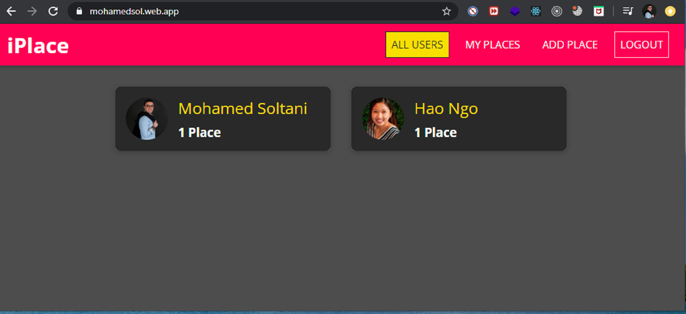
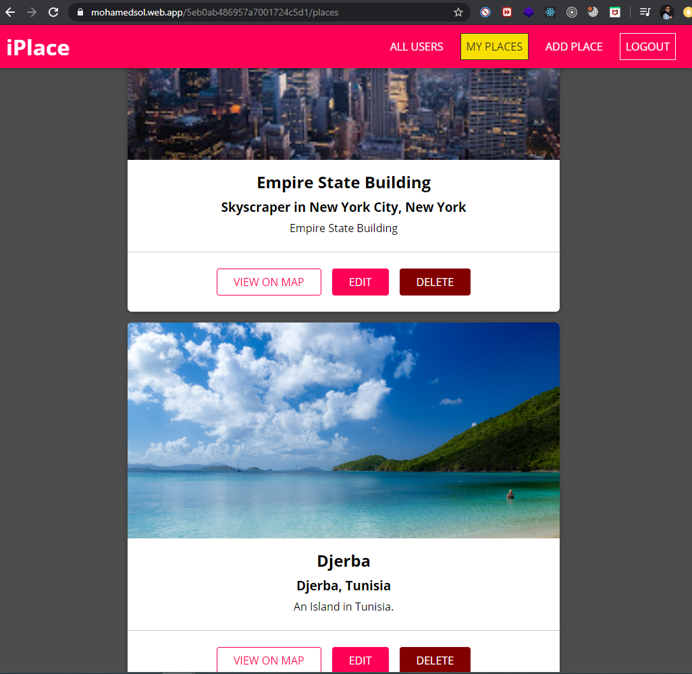

# SharePlaces-MERN-Project

 iPlace is a social media web site for people to share places that they visited, created using ReactJS, NodeJs, ExpressJS and MongoDB.

## Project
 
 iPlace is a social media web site for people to share places that they visited. Created using ReactJS, NodeJs, ExpressJS and MongoDB. This web site allows user to register, login, create, modifier and delete places. The most challenging and exciting part of this project was learning different technologies and how they work together.
 
 
